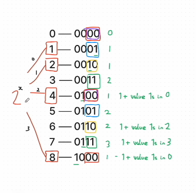
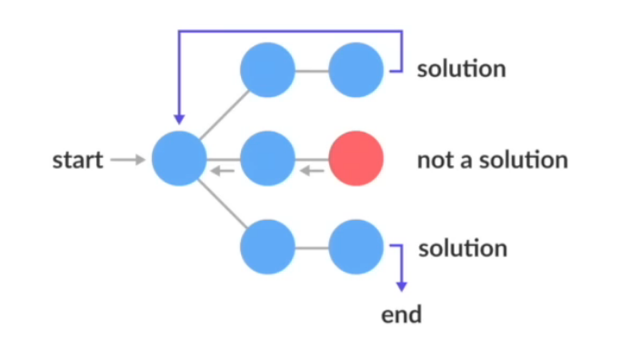

# Arrays

### 1. Two Sum [1]

Given an array of integers nums and an integer target, return indices of the two numbers such that they add up to target.\
You may assume that each input would have exactly one solution, and you may not use the same element twice.\
You can return the answer in any order.

Example 1:

Input: nums = [2,7,11,15], target = 9\
Output: [0,1]\
Explanation: Because nums[0] + nums[1] == 9, we return [0, 1].

Example 2:

Input: nums = [3,2,4], target = 6\
Output: [1,2]

Example 3:

Input: nums = [3,3], target = 6\
Output: [0,1]

**Solution:**
```python
class Solution:
    def twoSum(self, nums: List[int], target: int) -> List[int]:
        previousNumberMap = {}

        for index, value in enumerate(nums):
            diff = target - value

            if (previousNumberMap.get(diff) is not None): 
                return [index, previousNumberMap.get(diff)]
            
            previousNumberMap[value] = index
```

**Explanation:**

target - current_number => left_over_number

Check LeftOverNumber present previously in the list or in this case map

9 - 7 = 2

So, 2 + 7 => 9
And 2 is present in the Map


---
### 2. Find All Numbers Disappeared in an Array [448]

Given an array nums of n integers where nums[i] is in the range [1, n], return an array of all the integers in the range [1, n] that do not appear in nums.


Example 1:

Input: nums = [4,3,2,7,8,2,3,1]\
Output: [5,6]

Example 2:

Input: nums = [1,1]\
Output: [2]

**Solution**
```python
class Solution:
    def findDisappearedNumbers(self, nums: List[int]) -> List[int]:
        setNums = set(nums)
        result = []

        for x in range(1, len(nums) + 1):
            if x not in setNums:
                result.append(x)

        return result
```


---
### 3. Contains Duplicate [217]

Given an integer array nums, return true if any value appears at least twice in the array, and return false if every element is distinct.

Example 1:

Input: nums = [1,2,3,1]\
Output: true\
Explanation:\
The element 1 occurs at the indices 0 and 3.

Example 2:

Input: nums = [1,2,3,4]\
Output: false\
Explanation:\
All elements are distinct.

Example 3:

Input: nums = [1,1,1,3,3,4,3,2,4,2]\
Output: true

**Solution**
```python
class Solution:
    def containsDuplicate(self, nums: List[int]) -> bool:
        return len(nums) != len(set(nums))
```


---
### 4. Minimum time visiting all the points [1266]

On a 2D plane, there are n points with integer coordinates points[i] = [xi, yi]. Return the minimum time in seconds to visit all the points in the order given by points.

You can move according to these rules:

- In 1 second, you can either:
    - move vertically by one unit,
    - move horizontally by one unit, or
    - move diagonally sqrt(2) units (in other words, move one unit vertically then one unit horizontally in 1 second).

- You have to visit the points in the same order as they appear in the array.
- You are allowed to pass through points that appear later in the order, but these do not count as visits.

*Example 1:*\
Input: points = [[1,1],[3,4],[-1,0]]\
Output: 7\
Explanation: One optimal path is [1,1] -> [2,2] -> [3,3] -> [3,4] -> [2,3] -> [1,2] -> [0,1] -> [-1,0]\
Time from [1,1] to [3,4] = 3 seconds\
Time from [3,4] to [-1,0] = 4 seconds\
Total time = 7 seconds

*Example 2:*\
Input: points = [[3,2],[-2,2]]\
Output: 5


**Problem:**

From the list of Points, calculate minimum distance between First and Last Points (X1, Y1).

**Solution:**

If the first node is `10x` and `-5y` away. It's going to take exactly 10 steps from `0x` and `0y`, because you can only move `1x` at a time and the difference in `y` is made up by diagonal moves during the process of overcoming the difference `x`.

*[Trick]* So, Distance Between the two Co-ordinates *is maximum difference* of one Co-ordinate [Point]

**min_difference = max(abs(X2 - X1), abs(Y2 - Y1))**

Time O(n) : Space O(1)


**✅ Scenarios Where This Trick Works:**

This works **under a specific set of movement rules**, often seen in grid-based problems — like in chessboard-like movement.

You're allowed to move:
1. **One unit in the X direction** (left or right)
2. **One unit in the Y direction** (up or down)
3. **Or both at the same time**, i.e., a diagonal move (which changes X and Y both by ±1)

This is called **Chebyshev distance**, and it's common in pathfinding problems where diagonal movement costs the same as straight movement.


**Explanation:**

**🔍 Why It Works: Intuition**

Let's say you're at point (X1, Y1) and you want to go to (X2, Y2). The absolute differences are:


**dx = |X2 - X1|, dy = |Y2 - Y1|**

Now, imagine walking:

- You can reduce both **dx and dy** by doing **diagonal moves**.

- Once either dx or dy becomes 0, you do **straight moves** in the remaining direction.

So, in **one diagonal move**, you fix **1 unit in both X and Y directions**.

Hence:

- You can do **min(dx, dy)** diagonal moves.

- You then need **|dx - dy|** more moves in the dominant direction (X or Y).

So total moves =

- **min(dx,dy) (diagonal) + |dx-dy| (straight) = max(dx, dy)**

That's why:

- **Minimum distance= max(|X2-X1|, |Y2-Y1|)**

**🧠 Example:**

From (0, 0) to (4, 2):

**dx = 4**, **dy = 2**

You do 2 diagonal moves -> now at (2, 2)\
Still need 2 more moves in X -> now at (4, 2)\
Total = 4 moves = max(4, 2)

**✅ This Trick Works For:**
- Grid-based movement
- Diagonal movement allowed and costs same as orthogonal
- Chess King moves, for example


**Code Solution**
```python
class Solution:
    def minTimeToVisitAllPoints(self, points: List[List[int]]) -> int:
        minDistance = 0
        x1, y1 = points.pop()

        while points:
            x2, y2 = points.pop()
            minDistance += max(abs(x2 - x1), abs(y2 - y1))
            x1, y1 = x2, y2
        
        return minDistance
```


---
### 5. Spiral Matrix [54]

Given an m x n matrix, return all elements of the matrix in spiral order.

*Example 1:*\
Input: matrix = [[1,2,3],[4,5,6],[7,8,9]]\
Output: [1,2,3,6,9,8,7,4,5]

*Example 2:*\
Input: matrix = [[1,2,3,4],[5,6,7,8],[9,10,11,12]]\
Output: [1,2,3,4,8,12,11,10,9,5,6,7]

**Code Solution**
```python
class Solution:
    def spiralOrder(self, matrix: List[List[int]]) -> List[int]:
        result = []

        while matrix:

            # Step 1: Add the Top Row
            result += matrix.pop(0)

            # Step 2: Go Down / Add last elements
            if matrix and matrix[0]: # matrix[0] is to check wheather the x is not empty
                for x in matrix:
                    result.append(x.pop()) # you can do {if (row): result.append(x.pop())}; instead of matrix[0]
            
            # Step 3: Add the Last Row
            if matrix:
                result += matrix.pop()[::-1]

            # Step 4: Climb Up and Add first elements
            if matrix and matrix[0]:
                for x in matrix[::-1]:
                    result.append(x.pop(0))

        return result

        result = []
```


---
### 6. Number of Islands [200] {*BFS*}

Given an m x n 2D binary grid grid which represents a map of '1's (land) and '0's (water), return the number of islands.\
An island is surrounded by water and is formed by connecting adjacent lands horizontally or vertically. You may assume all four edges of the grid are all surrounded by water.

*Example 1:*\
Input: grid = [
  ["1","1","1","1","0"],
  ["1","1","0","1","0"],
  ["1","1","0","0","0"],
  ["0","0","0","0","0"]
]
Output: 1

*Example 2:*\
Input: grid = [
  ["1","1","0","0","0"],
  ["1","1","0","0","0"],
  ["0","0","1","0","0"],
  ["0","0","0","1","1"]
]
Output: 3

**Problem:**

Given a 2D m * n grid, where 1 is land and 0 is water, return the number of islands

**Solution:**

It's Breath-First-Search Problem
- Traverse Level by Level
- Left Side Smaller Number, Right Side Larger Number

Iterate through problem and perform dfs or bfs search finding a '1' to mark neighbour as visited, and complete the island.\
Visit each cell once during intial iteration and potentially twice when exploring BFS in each direction `[4 -> up down left right no_diagonals]` and we do this for M * N vertices, O(4 * m * n) * O(M * N).\
It might help to think of worst case senerio - matrix is all '1', so we have to visit every cell and explore every adjecent cell.\
For Space it could be stack/queue the entire grid if it is all 1s.

*Time & Space -> O(m * n)*

**✅ Scenarios Where This Trick Works**

| ✅ Works Well When...                         | ❌ Doesn't Work When...                          |
| -------------------------------------------- | ----------------------------------------------- |
| Finding connected regions (grids/graphs)     | Graph is weighted (use Dijkstra instead)        |
| Grid traversal / flood fill / clustering     | Diagonal connections needed (not included)      |
| Counting islands, lakes, provinces, clusters | You need optimal or shortest paths with weights |
| Any scenario with 4-directional connectivity | Problem requires topological sort or cycles     |


- A *deque (pronounced "deck")* is a data structure that allows elements to be added or removed from both the front and the rear, similar to a queue but with more flexibility, Act as [FIFO (queue)]/[LIFO (Stack)].

**Code Solution**
- Iterative Approach [BFS]
```python
class Solution:
    def numIslands(self, grid: List[List[str]]) -> int:

        if not grid: return 0

        visitedPlace = set() # To avoid duplicate entries
        count = 0

        def bfs(r, c):
            que = deque()
            visitedPlace.add((r, c))
            que.append((r, c))

            while que: # Use this while loop is if conditions atlast to make is recersive [346, 347 line]
                x, y = que.popleft()

                for dirx, diry in [(-1, 0), (1, 0), (0, -1), (0, 1)]:
                    cellx = x + dirx
                    celly = y + diry

                    if cellx >= 0 and celly >= 0 and (cellx, celly) not in visitedPlace and cellx < len(grid) and celly < len(grid[0]) and grid[cellx][celly] == '1':
                        que.append((cellx, celly))
                        visitedPlace.add((cellx, celly))

        

        for r in range(len(grid)):
            for c in range(len(grid[0])):
                if (r, c) not in visitedPlace and grid[r][c] == '1':
                    bfs(r, c) # Mark Visited
                    count += 1 # Increase Island Count

        return count
```

- Recursive Approach [Faster] [DFS]
```python
class Solution:
    def numIslands(self, grid: List[List[str]]) -> int:

        if not grid: return 0

        def bfs(r, c):
            # Recursive Approach
            if (r < 0 or r >= rows or c < 0 or c >= cols or grid[r][c] == '0'): return

            grid[r][c] = '0' # Mark Visited or Sink Island

            bfs(r + 1, c)
            bfs(r - 1, c)
            bfs(r, c + 1)
            bfs(r, c - 1)
        
        count = 0
        rows = len(grid)
        cols = len(grid[0])

        for r in range(rows):
            for c in range(cols):
                if grid[r][c] == '1':
                    bfs(r, c) # Mark Sink [Visited]
                    count += 1 # Increase Island Count

        return count
```


---
---
### **About DSF and BFS**

✅ **DFS (Depth-First Search)**

- For BFS Queue is used [Iterative version is Good and easy] [Level-Wise] [FIFO]
- For DFS Stack is used [Recursive version is Good and easy] [One-Sided] [LIFO]

| Style         | Mechanism                   | Why it's used                                                      |
| ------------- | --------------------------- | ------------------------------------------------------------------ |
| **Recursive** | Function call stack         | Natural, clean, and easy to write (especially in Python)           |
| **Iterative** | Manual stack (`stack = []`) | Needed when recursion depth is too large (e.g., huge grids/graphs) |

➡️ **Recursive DFS is usually simpler and faster** in Python unless stack depth becomes a problem.

---

✅ **BFS (Breadth-First Search)**

| Style              | Mechanism                   | Why it's used                                              |
| ------------------ | --------------------------- | ---------------------------------------------------------- |
| **Iterative only** | Queue (`collections.deque`) | Required to explore nodes **level-by-level** in FIFO order |

➡️ **BFS doesn't make sense recursively** because **recursion is naturally LIFO**, but BFS requires FIFO order.

---

🔁 **Summary of Your Insight**

| Algorithm | Preferred Method                                           | Data Structure                             |
| --------- | ---------------------------------------------------------- | ------------------------------------------ |
| **DFS**   | ✅ Recursive (easy), 🟡 Iterative (safe for deep recursion) | Stack (explicit or implicit via recursion) |
| **BFS**   | ✅ Iterative only (queue-based)                             | Queue (`deque`)                            |


🎯 **Bonus Tip:**

If you're doing:

* **Pathfinding / Shortest Path (unweighted graphs)** → Use **BFS**
* **Exploring all connected components / Islands (clustering)** → Use **DFS** or **BFS**
* **Maze solving (all paths)** → DFS is usually cleaner


---
---
### 7. Best Time to Buy and Sell Stock [121] {*Two-Pointer*}

You are given an array prices where prices[i] is the price of a given stock on the ith day.\
You want to maximize your profit by choosing a single day to buy one stock and choosing a different day in the future to sell that stock.\
Return the maximum profit you can achieve from this transaction. If you cannot achieve any profit, return 0.

*Example 1:*\
Input: prices = [7,1,5,3,6,4]\
Output: 5

*Example 2:*\
Input: prices = [7,6,4,3,1]\
Output: 0

**Explanation:**

Its called `Greedy Method` operates on `accepting best option now`
- The problem can be solved by making `locally optimal choices` that lead to `global optimality`.
- You can prove (or guess) that choosing the best now will always work.

Move to next `Lower Price compared to current` as you have already calculated `All the previous maxProfits`\
And you are `comparing that previous maxProfits with latest one` to get new `maxProfit`

**Code Solution**
```python
class Solution:
    def maxProfit(self, prices: List[int]) -> int:
        if len(prices) == 1: return 0

        maxPrice = 0
        x, y = 0, 1

        # [6, 20, 5, 1, 1, 9]
        while y < len(prices):
            if prices[x] < prices[y]:
                maxPrice = max(maxPrice, prices[y] - prices[x])

            else:
                x = y # update buy day to new lower price

            y += 1

        return maxPrice

# BrutForce
for i in range(len(prices)):
    for j in range(i+1, len(prices)):
        maxProfit = max(maxProfit, prices[j] - prices[i])
```


---
---

### 🧠 Final Rule of Thumb:

| Goal / Pattern                  | Strategy         |
| ------------------------------- | ---------------- |
| Make best decision now          | Greedy           |
| Work with sorted or linear data | Two Pointers     |
| Work with substrings/subarrays  | Sliding Window   |
| Need to explore all choices     | DFS/Backtracking |
| Need to reuse solutions         | DP               |


---
---
### 8. Square Of Sorted Arrays [977]

Given an integer array nums sorted in non-decreasing order, return an array of the squares of each number sorted in non-decreasing order.

*Example 1:*\
Input: nums = [-4,-1,0,3,10]\
Output: [0,1,9,16,100]

*Example 2:*\
Input: nums = [-7,-3,2,3,11]\
Output: [4,9,9,49,121]

**Explanation:**
Square Root of  negative number == to square root of positive number\
`-4^2` == `4^2` -> 16

**Code Solution**
```python
# BrutForce
class Solution:
    def sortedSquares(self, nums: List[int]) -> List[int]:
        nums = [num ** 2 for num in nums]
        nums.sort() # O(n log n)

        return nums

# O(n) Solution with Higher Space Complexity
class Solution:
    def sortedSquares(self, nums: List[int]) -> List[int]:
        # Used Merge Sort Algo

        # Check if num exist
        if not nums: return nums

        # Check if no-negative number [No Sorting Needed]
        if nums[0] > 0: return [num ** 2 for num in nums]

        # Split after negative number
        m = len(nums) - 1
        for i in range(len(nums)):
            if (nums[i] >= 0):
                m = i
                break

        # Creating negative number list with square
        nL = [num ** 2 for num in nums[:m][::-1]]
        pL = [num ** 2 for num in nums[m:]]
        result = []

        # Merge the lists
        x = 0
        y = 0

        while x < len(nL) and y < len(pL):
            if (nL[x] > pL[y]):
                result.append(pL[y])
                y += 1

            else:
                result.append(nL[x])
                x += 1
        
        if (x < len(nL)): result += nL[x:]
        if (y < len(pL)): result += pL[y:]

        return result

# O(n) Solution
class Solution:
    def sortedSquares(self, nums: List[int]) -> List[int]:
        # O(n) Solution
        x = 0
        y = len(nums) - 1
        result = []

        while x <= y:
            sqr = 0
            if (abs(nums[x]) > abs(nums[y])):
                sqr = nums[x]
                x += 1
            else:
                sqr = nums[y]
                y -= 1

            result.insert(0, sqr ** 2)
        
        return result
```


---
### 9. 3Sum [15]

Given an integer array nums, return all the triplets [nums[i], nums[j], nums[k]] such that i != j, i != k, and j != k, and nums[i] + nums[j] + nums[k] == 0.

Notice that the solution set must not contain duplicate triplets.

*Example 1:*\
Input: nums = [-1,0,1,2,-1,-4]\
Output: [[-1,-1,2],[-1,0,1]]

*Example 2:*\
Input: nums = [0,1,1]\
Output: []

**Problem:**\
Given an array of ints, return the list of triplets which add to 0, can only use same int twice if in list is twice.

**Solution:**\
Two Pointer, Sort and iterate through list for first value in triplet. Use two pointers, moving left and right to find 0

`Sorting the array first`
- This allows us to use two-pointers efficiently for the inner part of the problem.
- Also helps to easily skip duplicates, which is key to avoiding repeated triplets in the result.
- Why sort the array?
    - To use two-pointer efficiently and handle duplicates easily.
- Why do we skip duplicate nums[i]?
    - To avoid generating the same triplets again.
- How can one nums[i] produce multiple triplets?
    - Because the two-pointer search finds all pairs that sum with nums[i] to make zero -> including cases with duplicate values.

**Code Solution**
```python
class Solution:
    def threeSum(self, nums: List[int]) -> List[List[int]]:
        result = []

        # Sort to avoid duplications easily
        nums.sort()

        # If no negative numbers
        if nums[0] > 0: return []

        for i, val in enumerate(nums):
            # Avoid duplicate results [As same value is already evaluated]
            if i > 0 and val == nums[i - 1]: continue

            # Pointer to find remaining 2 sums
            x = i + 1
            y = len(nums) - 1

            while x < y:
                sum = val + nums[x] + nums[y]

                if sum > 0: y -= 1
                elif sum < 0: x += 1
                else:
                    result.append([val, nums[x], nums[y]])
                    x += 1

                    # Avoid duplicate results [As same value is already evaluated]
                    while x < y and nums[x] == nums[x - 1]: x += 1

        return result
```


---
---
### ⚠️ When to Sort in a Problem
Use sorting when:
- You need to compare elements in a certain order (e.g., Two-Sum variants, Intervals, Greedy decisions).
- You want to apply two-pointer or sliding window approaches.
- You want to remove duplicates or group similar elements.

Don't sort:
- When the original order of elements matters (e.g., for subsequences, permutations).
- Or if the cost of sorting is too high and not justified.

### 🧠 Key Benefits of Sorting:

| Purpose                   | Why it helps                                                                                                                |
| ------------------------- | --------------------------------------------------------------------------------------------------------------------------- |
| **Two-pointer technique** | Only works efficiently on sorted data                                                                                       |
| **Skip duplicates**       | Consecutive duplicates are easy to spot                                                                                     |
| **Early pruning**         | Once the current number is > 0, we can break early (because nums\[x] + nums\[y] + nums\[z] > 0 will always hold after that) (So the smallest possible sum = 1 + 1 + 1 = 3 > 0) |


---
---
###  10. Missing Number [268]
Given an array `nums` containing `n` distinct numbers in the range `[0, n]`, return the only number in the range that is missing from the array.

Notice that the solution set must not contain duplicate triplets.

*Example 1:*\
Input: nums = [3,0,1]\
Output: 2

*Example 2:*\
Input: nums = [0,1]\
Output: 2

**Solution:**\
The Sum of first `n` Natural Numbers - Sum of array elements => Missing number.\

$$
Sum = \frac{n(n + 1)}{2}
$$


**Code Solution**
```python
class Solution:
    def missingNumber(self, nums: List[int]) -> int:
        return sum(range(len(nums) + 1)) - sum(nums)
```


---
###  11. How Many Numbers Are Smaller Than the Current Number [1365]
Given the array nums, for each `nums[i]` find out how many numbers in the array are smaller than it. That is, for each `nums[i]` you have to count the number of valid `j's` such that `j != i` and `nums[j] < nums[i]`.\
Return the answer in an array.

*Example 1:*\
Input: nums = [8,1,2,2,3]\
Output: [4,0,1,1,3]\
Explanation:\
For nums[0]=8 there exist four smaller numbers than it (1, 2, 2 and 3).\
For nums[1]=1 does not exist any smaller number than it.\
For nums[2]=2 there exist one smaller number than it (1).\ 
For nums[3]=2 there exist one smaller number than it (1). \
For nums[4]=3 there exist three smaller numbers than it (1, 2 and 2).

*Example 2:*\
Input: nums = [6,5,4,8]\
Output: [2,1,0,3]

*Example 3:*\
Input: nums = [7,7,7,7]\
Output: [0,0,0,0]

**Solution:**\
- Sort the array, so index of the element will be count of the lower elements as well
- create dictionary and also add not in check to avoid value overriding
- finally returning the list

**Code Solution**
```python
class Solution:
    def smallerNumbersThanCurrent(self, nums: List[int]) -> List[int]:
        sortedList = sorted(nums) # Creates new list [nums.sort() modifies original list]
        numberMapping = {}

        for index, value in enumerate(sortedList):
            if value not in numberMapping:
                numberMapping[value] = index
        
        result = []
        for value in nums:
            result.append(numberMapping[value])

        return result
```


---
###  12. Longest Mountain in the Array [845]
You may recall that an array arr is a mountain array if and only if:
- `arr.length >= 3`
- There exists some index i (0-indexed) with 0 < i < arr.length - 1 such that:
    - `arr[0] < arr[1] < ... < arr[i - 1] < arr[i]`
    - `arr[i] > arr[i + 1] > ... > arr[arr.length - 1]`

Given an integer array arr, return the length of the longest subarray, which is a mountain. Return 0 if there is no mountain subarray.

*Example 1:*\
Input: arr = [2,1,4,7,3,2,5]\
Output: 5\
Explanation: The largest mountain is [1,4,7,3,2] which has length 5.

*Example 2:*\
Input: arr = [2,2,2]\
Output: 0\
Explanation: There is no mountain.

*Example 3:*\
Input: arr = [0,1,2,3,4,5,4,3,2,1,0]\
Output: 11

**Solution:**
- Find the Peak and Than Slide from both slides

**Code Solution**
```python
class Solution:
    def longestMountain(self, arr: List[int]) -> int:
        # No Mountain Array
        if len(arr) < 3: return 0

        result = 0

        # Find the Peak and Slide on both sides from peak
        for i in range(1, len(arr) - 1):

            # It's the Peak [Highest Value]
            if arr[i - 1] < arr[i] > arr[i + 1]:

                # Slide Left:
                x = i
                while x > 0:
                    if arr[x] > arr[x - 1]: x -= 1
                    else: break

                # Slide Right:   
                y = i
                while y < len(arr) - 1:
                    if arr[y] > arr[y + 1]: y += 1
                    else: break

                result = max(result, y - x + 1)

        return result
```


---
###  13. Contains Duplicate II [219]  {*Sliding-Window*}
Given an integer array `nums` and an integer `k`, return `true` if there are two distinct indices `i` and `j` in the array such that `nums[i] == nums[j]` and `abs(i - j) <= k`.

*Example 1:*\
Input: nums = [1,2,3,1], k = 3\
Output: true

*Example 2:*\
Input: nums = [1,0,1,1], k = 1\
Output: true

*Example 3:*\
Input: nums = [1,2,3,1,2,3], k = 2\
Output: false

**Solution:**
- Maintain the Window of `k` as `abs(i - j) <= k`, if we maintain the window of `k` then `|i - j|, |(i + 1) - (j + 1)|` ....

**Code Solution**
```python
# Using Set
class Solution:
    def containsNearbyDuplicate(self, nums: List[int], k: int) -> bool:
        seen = set()

        for index, value in enumerate(nums):
            if value in seen: return True

            seen.add(value)
            # Maintain Window Size [K is Window Size]
            if len(seen) > k:
                # [index[4] - k[4] => 0[Remove]]
                seen.remove(nums[index - k])
        
        return False

# Using Distionary
class Solution:
    def containsNearbyDuplicate(self, nums: List[int], k: int) -> bool:
        dist = {}

        for index, value in enumerate(nums):
            if value in dist and (index - dist[value] <= k): return True
            dist[value] = index
            
        return False
```

---
###  14. Minimum Absolute Difference [1200]
Given an array of distinct integers `arr`, find all pairs of elements with the minimum absolute difference of any two elements.

Return a list of pairs in ascending order(with respect to pairs), each pair `[a, b]` follows
- `a, b` are from `arr`
- `a < b`
- `b - a` equals to the minimum absolute difference of any two elements in `arr`

*Example 1:*\
Input: arr = [4,2,1,3]\
Output: [[1,2],[2,3],[3,4]]\
Explanation: The minimum absolute difference is 1. List all pairs with difference equal to 1 in ascending order.

*Example 2:*\
Input: arr = [1,3,6,10,15]\
Output: [[1,3]]

*Example 3:*\
Input: arr = [3,8,-10,23,19,-4,-14,27]\
Output: [[-14,-10],[19,23],[23,27]]

**Explanation:**\
- The `minimum absolute difference` is a minimum difference between `two consecutive elements` in the `sorted array`.

**Code Solution**
```python
class Solution:
    def minimumAbsDifference(self, arr: List[int]) -> List[List[int]]:
        # Sort first to find minimum absolute difference
        arr.sort()

        # Find minimum absolute difference
        minDiff = float('inf')
        for i in range(1, len(arr)):
            minDiff = min(minDiff, arr[i] - arr[i - 1])

        # Finding Pairs using window of pair
        result = []
        for i in range(1, len(arr)):
            if (arr[i] - arr[i - 1]) <= minDiff:
                result.append([arr[i - 1], arr[i]])

        return result
```

---
---
### 🧠 Python Negative and Positive Infinities
`float('inf') > 1000000000000` evaluates to `True`

- positive_infinity = **float('inf')**
- negative_infinity = **float('-inf')**


---
---
###  15. Minimum Size Subarray Sum [209]
Given an array of positive integers `nums` and a positive integer `target`, return the `minimal length` of a `subarray` whose sum is `greater than or equal to target`. If there is no such subarray, return 0 instead..

*Example 1:*\
Input: target = 7, nums = [2,3,1,2,4,3]\
Output: 2\
Explanation: The subarray [4,3] has the minimal length under the problem constraint.

*Example 2:*\
Input: target = 4, nums = [1,4,4]\
Output: 1

*Example 3:*\
Input: target = 11, nums = [1,1,1,1,1,1,1,1]\
Output: 0

**Code Solution**
```python
class Solution:
    def minSubArrayLen(self, target: int, nums: List[int]) -> int:
        x = 0

        total = 0
        result = float('inf')

        for y in range(len(nums)):
            total += nums[y]

            while total >= target:
                result = min(result, y - x + 1)

                total -= nums[x]
                x += 1

        if (result == float('inf')): return 0
        return result
```


---
###  16. Contains Duplicate II [219]  {*Bit Manipulation*}
Given a `non-empty` array of integers `nums`, every element appears twice except for one. Find that single one.\
You must implement a solution with a linear runtime complexity and use only constant extra space.

*Example 1:*\
Input: [2,2,1]\
Output: 1
```
nums 2
xor 2
nums 2
xor 0
nums 1
xor 1
```

*Example 2:*\
Input: [4,1,2,1,2]\
Output: 4
```
nums 4
xor 4
nums 1
xor 5
nums 2
xor 7
nums 1
xor 6
nums 2
xor 4
```

*Example 3:*\
Input: [1]\
Output: 1
```
nums 1
xor 1
```

**Code Solution**
```python
class Solution:
    def singleNumber(self, nums: List[int]) -> int:
        xor = 0
        
        for i in nums:
            print('nums', i)
            xor ^= i
            print('xor', xor)

        return xor
```

---
---
### 🧠 Bit Manipulation (Quick Reference)

| Operator | Name        | Meaning                  | Example  | Result |
| -------- | ----------- | ------------------------ | -------- | ------ |
| `&`      | AND         | 1 if **both bits** are 1 | `5 & 3`  | `1`    |
| `\|`     | OR          | 1 if **any bit** is 1    | `5 \| 3` | `7`    |
| `^`      | XOR         | 1 if **bits differ**     | `5 ^ 3`  | `6`    |
| `~`      | NOT         | Inverts all bits         | `~5`     | `-6`   |
| `<<`     | Left Shift  | Shifts bits left (×2)    | `5 << 1` | `10`   |
| `>>`     | Right Shift | Shifts bits right (÷2)   | `5 >> 1` | `2`    |


---
---
###  17. Coin Change [322]  {*Dynamic Programing [Reusing the calculated subprogramming `Memoization`]*}
You are given an integer array `coins` representing coins of different denominations and an integer amount representing a total `amount` of money.\
Return the fewest number of coins that you need to make up that amount. If that amount of money cannot be made up by any combination of the coins, return `-1`.\
You may assume that you have an infinite number of each kind of coin.

*Example 1:*\
Input: coins = [1,2,5], amount = 11\
Output: 3\
Explanation: 11 = 5 + 5 + 1


*Example 2:*\
Input: coins = [2], amount = 3\
Output: -1


*Example 3:*\
Input: coins = [1], amount = 0\
Output: 0

**Explanation:**\
- dp[i] = minimum number of `coins` needed to make `amount i`.
- dp[i] = best solution of smaller problem + cost of current choice

#### 🎯 Real-Life Analogy 💰

You want to pay ₹10
You give a ₹5 note

You already used 1 note

Now you must find the minimum notes to pay the remaining ₹5

👉 Total notes = 1 + best way to pay ₹5 {1 + dp[i - c]}


**Code Solution**
```python
class Solution:
    def coinChange(self, coins: List[int], amount: int) -> int:
        dp = [amount + 1] * (amount + 1)
        dp[0] = 0

        for i in range(1, amount + 1):

            for c in coins:
                if (i - c) >= 0:
                    
                    dp[i] = min(dp[i], 1 + dp[i - c])

        return dp[amount] if (dp[amount] != amount + 1) else -1 
        # amount + 1 acts like ∞ (infinity) Check, which means no combination exists
        # coins = [2], amount: 3
```

#### 💰 Coin Change — Visual Dry Run
Example
```
coins = [1, 3, 4]
amount = 6
```

##### 🧠 What dp[i] Means

- Minimum number of coins needed to make amount i

##### 🧱 Step 1: Initialize DP Table

We use ∞ = amount + 1 = 7

| Amount (i) | 0 | 1 | 2 | 3 | 4 | 5 | 6 |
| ---------- | - | - | - | - | - | - | - |
| dp[i]      | 0 | ∞ | ∞ | ∞ | ∞ | ∞ | ∞ |


##### 🔁 Step 2: Fill the DP Table

We go left → right (small → big)

🔹 i = 1

Try each coin:

coin 1 → 1 + dp[0] = 1

coin 3 → ❌ too big

coin 4 → ❌ too big

**| dp[1] = 1 |**

🔹 i = 2

coin 1 → 1 + dp[1] = 2

coin 3 → ❌

coin 4 → ❌

**| dp[2] = 2 |**

🔹 i = 3

coin 1 → 1 + dp[2] = 3

coin 3 → 1 + dp[0] = 1 ✅

coin 4 → ❌

**| dp[3] = 1 |**

🔹 i = 4

coin 1 → 1 + dp[3] = 2

coin 3 → 1 + dp[1] = 2

coin 4 → 1 + dp[0] = 1 ✅

**| dp[4] = 1 |**

🔹 i = 5

coin 1 → 1 + dp[4] = 2

coin 3 → 1 + dp[2] = 3

coin 4 → 1 + dp[1] = 2

**| dp[5] = 2 |**

🔹 i = 6

coin 1 → 1 + dp[5] = 3

coin 3 → 1 + dp[3] = 2 ✅

coin 4 → 1 + dp[2] = 3

**| dp[6] = 2 |**

##### ✅ Final DP Table

| Amount | 0 | 1 | 2 | 3 | 4 | 5 | 6 |
| ------ | - | - | - | - | - | - | - |
| dp     | 0 | 1 | 2 | 1 | 1 | 2 | 2 |

- 🎯 Answer: `dp[6] = 2`

- (3 + 3)

---
---
### 🌳 BFS & DFS with DP — Quick Notes
🧠 Core Idea
- DFS / BFS → explore states
- DP (Memo / Visited) → avoid recomputing states
- Explore first, remember results later

## 1️⃣ DFS + DP (⭐ MOST COMMON & RECOMMENDED)
✅ Use this when:
- You are building combinations step by step
- Choices depend on previous choices
- You want all combinations or to check feasibility
- The state can repeat

Why DFS?
- Natural include / exclude structure
- Uses recursion stack instead of a queue
- Easy to memoize states

## 2️⃣ BFS + DP (Less common, but useful)
✅ Use this when:
- You want the shortest path
- Levels matter (step-by-step depth)
- Each step has equal cost

Why BFS?
- Explores level by level
- Guarantees minimum steps

## 🔑 Golden Summary
- 🔥 Combinations → DFS
- 🔥 Optimization → DP
- 🔥 Minimum steps → BFS


---
---
###  18. Climbing Stairs [70]
You are climbing a staircase. It takes `n` steps to reach the top.\
Each time you can either climb `1` or `2` steps. In how many distinct ways can you climb to the top?

*Example 1:*\
Input: n = 2\
Output: 2\
Explanation: There are two ways to climb to the top.
1. 1 step + 1 step
2. 2 steps


*Example 2:*\
Input: n = 3\
Output: 3\
Explanation: There are three ways to climb to the top.\
1. 1 step + 1 step + 1 step
2. 1 step + 2 steps
3. 2 steps + 1 step


**Code Solution**
```python
class Solution:
    def climbStairs(self, n: int) -> int:
        if n <= 2: return n

        dp = [0] * (n + 1)
        dp[0] = 0
        dp[1] = 1
        dp[2] = 2

        for i in range(3, n + 1):
            dp[i] = dp[i - 1] + dp[i - 2]

        return dp[n]
```


---
###  19. Maximum Subarray [53]
Given an integer array `nums`, find the `subarray` with the largest sum, and return its sum.

*Example 1:*\
Input: nums = [-2,1,-3,4,-1,2,1,-5,4]\
Output: 6\
Explanation: The subarray [4,-1,2,1] has the largest sum 6.


*Example 2:*\
Input: nums = [1]\
Output: 1\
Explanation: The subarray [1] has the largest sum 1.

*Example 3:*\
Input: nums = [5,4,-1,7,8]
Output: 23
Explanation: The subarray [5,4,-1,7,8] has the largest sum 23.


**Code Solution**
```python
class Solution:
    def maxSubArray(self, nums: List[int]) -> int:
        currentSum = 0
        maxSum = float('-inf')

        for n in nums:
            if currentSum < 0: currentSum = 0
            
            currentSum += n
            maxSum = max(currentSum, maxSum)

        return maxSum
```


---
###  20. Counting Bits [338]

Given an integer `n`, return an array `ans` of length `n + 1` such that for each `i` (`0 <= i <= n`), `ans[i]` is the number of `1`'s in the binary representation of `i`.

**Explanation:**
- basically you have to find the number of `1`'s to create the `i`.

*Example 1:*\
Input: n = 2\
Output: [0,1,1]\
Explanation:\
0 --> 0\
1 --> 1\
2 --> 10


*Example 2:*\
Input: n = 5\
Output: [0,1,1,2,1,2]\
Explanation:\
0 --> 0\
1 --> 1\
2 --> 10\
3 --> 11\
4 --> 100\
5 --> 101

*Example 3:*\
Input: n = 3\
Output: [0,1,1,2]


**Solution:**
- basically you have to find the number of `1`'s to create the `i`.
- You can see the repeating pattern
- Taking the previous value and adding one to it gives the answer, as when the offset [power] changes the 1's reset and starts increasing again.




**Code Solution**
```python
class Solution:
    def countBits(self, n: int) -> List[int]:
        dp = [0] * (n + 1)
        offset = 1

        for i in range(1, n + 1):
            if offset * 2 == i:
                offset = i

            dp[i] = 1 + dp[i - offset]

        return dp
```


---
### 21. Range Sum Query - Immutable [303]

Given an integer array nums, handle multiple queries of the following type:\
Calculate the sum of the elements of nums between indices left and right inclusive where left <= right.\
Implement the `NumArray` class:
- `NumArray(int[] nums)` Initializes the object with the integer array `nums`.
- `int sumRange(int left, int right)` Returns the sum of the elements of `nums` between indices `left` and `right` inclusive (i.e. `nums[left] + nums[left + 1] + ... + nums[right]`).


*Example 1:*\
Input:\
["NumArray", "sumRange", "sumRange", "sumRange"]\
[[[-2, 0, 3, -5, 2, -1]], [0, 2], [2, 5], [0, 5]]

Output:\
[null, 1, -1, -3]

Explanation:\
NumArray numArray = new NumArray([-2, 0, 3, -5, 2, -1]);\
numArray.sumRange(0, 2); // return (-2) + 0 + 3 = 1\
numArray.sumRange(2, 5); // return 3 + (-5) + 2 + (-1) = -1\
numArray.sumRange(0, 5); // return (-2) + 0 + 3 + (-5) + 2 + (-1) = -3\


**Code Solution**
```python
class NumArray:
    num = []
    def __init__(self, nums: List[int]):
        self.nums = nums

    def sumRange(self, left: int, right: int) -> int:
        return sum(self.nums[left:right + 1])


# --- Or Using Prefix Sum -----
class NumArray:
    num = []
    def __init__(self, nums: List[int]):
        self.prefixSum = [0]
        for num in nums: self.prefixSum.append(self.prefixSum[-1] + num)

    def sumRange(self, left: int, right: int) -> int:
        return self.prefixSum[right + 1] - self.prefixSum[left]

# nums[-1] -> Last Element
# Why right + 1 -> First element is zero
```

---
---
### Back Tracking

BackTracking is a problem - solving algorithmic technique that involves finding a solution incrementally by trying different options and undoing them if they lead to a dead end.



#### Permutations:
- The number of ways to arrange things
- order matters

#### Combinations:
- The number of ways to choose things
- order doesn't matter


---
---
### 22. Last Letter Permutation [784]  {*BackTracking*}
Given a string `s`, you can transform every letter individually to be lowercase or uppercase to create another string.\
Return a list of all possible strings we could create. Return the output in `any order`.

*Example 1:*\
Input: s = "a1b2"\
Output: ["a1b2","a1B2","A1b2","A1B2"]


*Example 2:*\
Input: s = "3z4"\
Output: ["3z4","3Z4"]


**Code Solution**
```python
# Iterative Approach
class Solution:
    def letterCasePermutation(self, s: str) -> List[str]:
        # As '' is present than it will iterate once and a in added to temp
        output = ['']

        for c in s:
            tmp = []
            if c.isalpha():
                for o in output:
                    tmp.append(o + c.lower())
                    tmp.append(o + c.upper())
            else:
                for o in output:
                    tmp.append(o + c)

            output = tmp

        return output

# Recursion
class Solution:
    def letterCasePermutation(self, s: str) -> List[str]:
        res = []

        def backtracking(sub = '', i = 0):
            if (len(sub) == len(s)):
                res.append(sub)
                return

            if s[i].isalpha():
                backtracking(sub + s[i].swapcase(), i + 1)
            backtracking(sub + s[i], i + 1)

        backtacking()
        return res
   
```

**Dry Run Iterative**

*Input: a1b2*

*Output:*
```
['']
[[A], [a]] = o
[[A1], [a1]] = o
[[A1B], [a1b]] = o
...
```

---
### 23. Subsets [78]
Given an integer array `nums` of unique elements, return all possible `subsets` (the power set {all combinations including '[]'}).\
The solution set `must not` contain duplicate subsets. Return the solution in `any order`.

*Example 1:*\
Input: nums = [1,2,3]\
Output: [[],[1],[2],[1,2],[3],[1,3],[2,3],[1,2,3]]

*Example 2:*\
Input: nums = [0]\
Output: [[],[0]]


**Code Solution**
```python
class Solution:
    def subsets(self, nums: List[int]) -> List[List[int]]:

        def backtracking(start, path):

            # path[:] creates a new list
            # Otherwise all references would change later
            result.append(path[:])

            for i in range(start, len(nums)):
                path.append(nums[i])
                backtracking(i + 1, path) # Continue to build subset from next element
                path.pop()

        result = []
        backtracking(0, [])
        return result
```

**Decision Tree**

*For*
```
nums = [1,2,3]
```

*Tree*
```
[]
├── [1]
│   ├── [1,2]
│   │   ├── [1,2,3]
│   │   └── backtrack
│   ├── [1,3]
│   └── backtrack
├── [2]
│   ├── [2,3]
│   └── backtrack
├── [3]
└── backtrack
```

*Call Stack*
```
backtracking(0, [])
 └── backtracking(1, [1])
      └── backtracking(2, [1,2])
           └── backtracking(3, [1,2,3])
      └── backtracking(3, [1,3])
 └── backtracking(2, [2])
      └── backtracking(3, [2,3])
 └── backtracking(3, [3])
```

*Time & Space Complexity*
```
Let n = len(nums)

Number of subsets:
2^n

Time:  O(2^n)
Space: O(n) recursion depth
```

**Core Backtracking Template {This Pattern appears everywhere}**
```python
def backtrack(start, path):
    save(path)

    for i in range(start, n):
        choose(i)
        backtrack(i+1, path)
        unchoose(i)

#
# You are walking a tree of decisions, and at every node you record the path so far, then try all possible next steps, and undo after returning.
```


---
### 24. Combinations [77]
Given two integers `n` and `k`, return all possible combinations of `k` numbers chosen from the range `[1, n]`.\
You may return the answer in any order.

*Example 1:*\
Input: n = 4, k = 2\
Output: [[1,2],[1,3],[1,4],[2,3],[2,4],[3,4]]\
Explanation: There are 4 choose 2 = 6 total combinations.\
Note that combinations are unordered, i.e., [1,2] and [2,1] are considered to be the same combination.

*Example 2:*\
Input: n = 1, k = 1\
Output: [[1]]\
Explanation: There is 1 choose 1 = 1 total combination.


**Code Solution**
```python
class Solution:
    def combine(self, n: int, k: int) -> List[List[int]]:

        def backTracking(start, path):
            if len(path) == k:
                result.append(path[:])
                return

            for i in range(start, n + 1):
                path.append(i)
                backTracking(i + 1, path)
                path.pop()

        result = []
        backTracking(1, []) # Because Range starts with zero
        return result
```